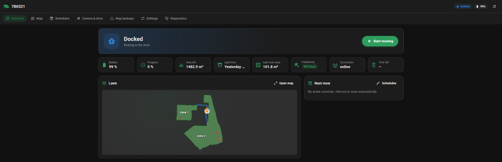
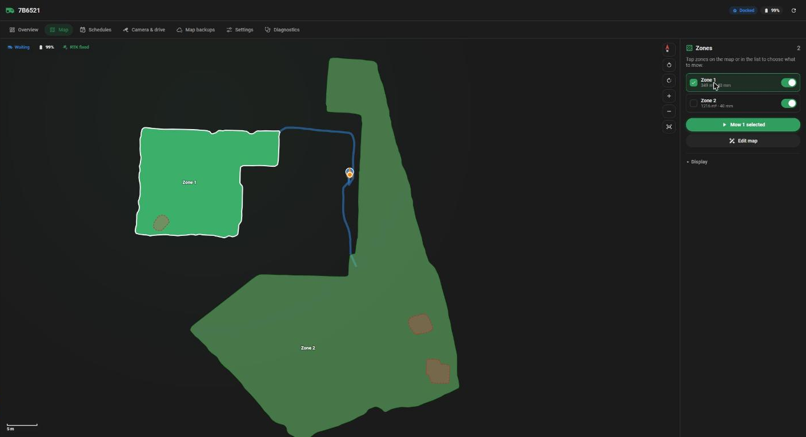
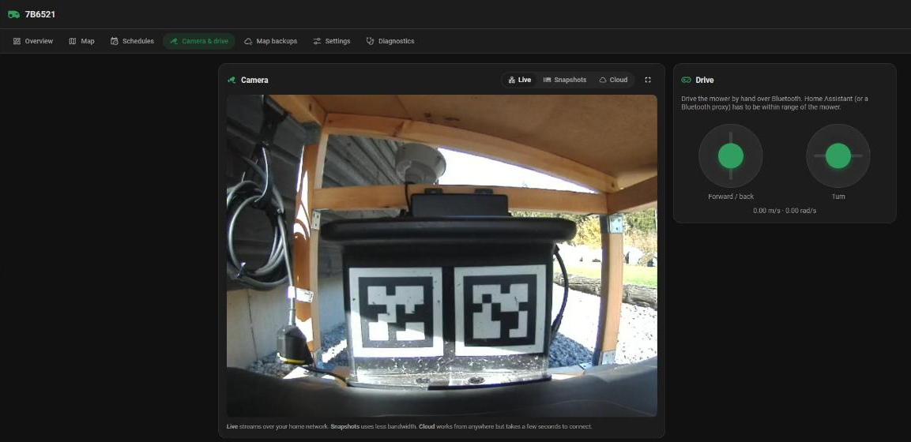
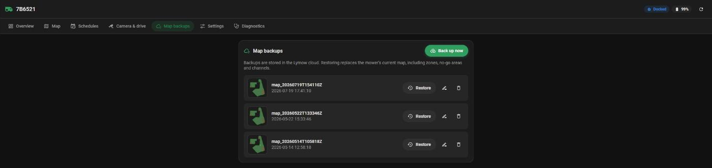
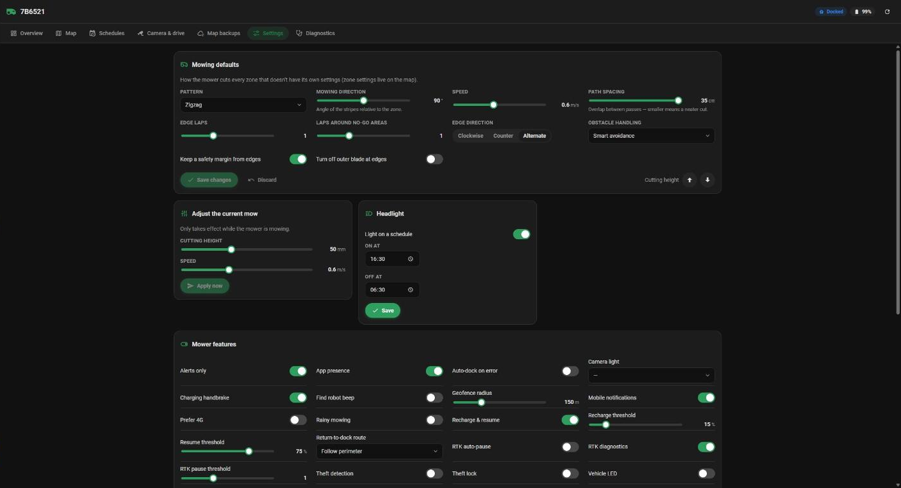
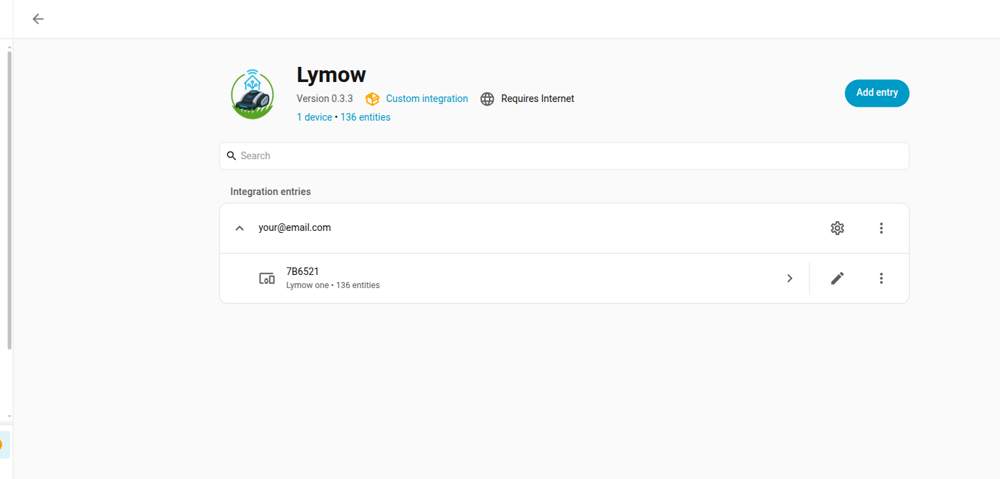

# Screenshots

The **Lymow** sidebar panel (see the README for what each section does).

## Overview

## Map

Tap zones to mow or merge them; **Edit map** reshapes zones and renames or deletes zones, no-go areas and channels.

## Camera & drive

## Map backups

## Settings

## Integration setup

